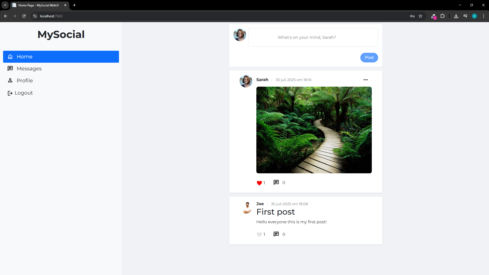
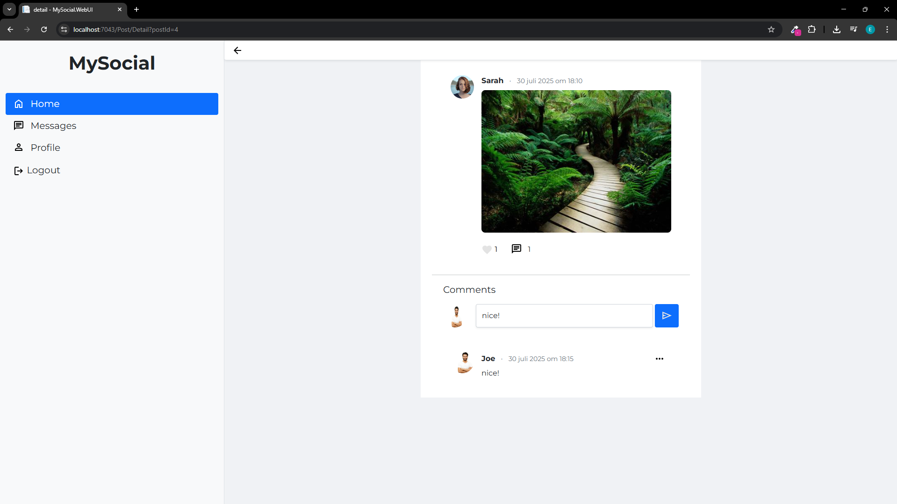
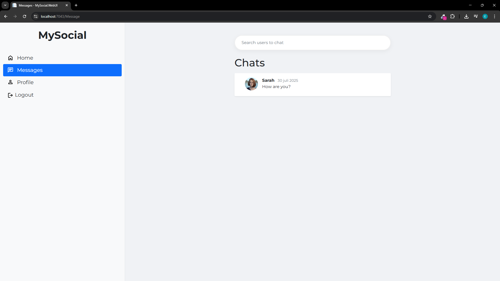
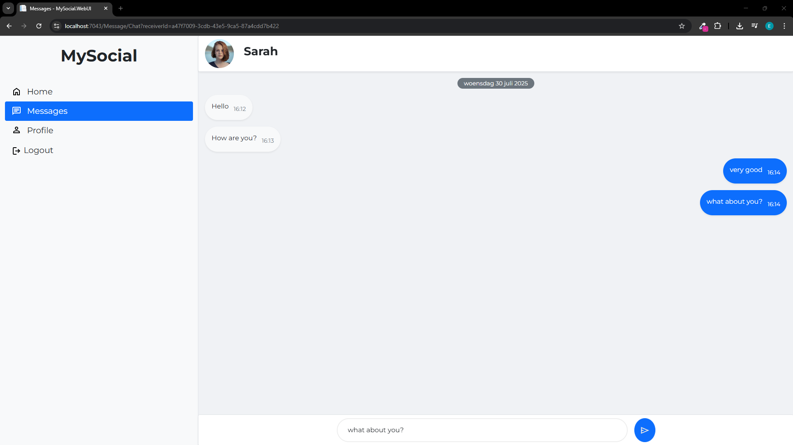

# MySocial

A social media platform built with ASP.NET Core that allows users to create posts, interact with content through likes and comments, and communicate via real-time messaging.

## 📸 Screenshots





## Features

- **User Authentication & Authorization** - Secure user registration and login with ASP.NET Core Identity
- **Post Management** - Create, edit, and delete posts with rich text editor support
- **Social Interactions** - Like and comment on posts
- **Real-time Messaging** - Chat functionality using SignalR
- **File Upload** - Support for image uploads in posts

## Tech Stack

### Backend
- **ASP.NET Core 8.0** - Web framework
- **Entity Framework Core** - ORM for database operations
- **SQL Server** - Primary database
- **SQLite** - Development database
- **SignalR** - Real-time communication
- **ASP.NET Core Identity** - Authentication and authorization

### Frontend
- **Razor Pages/MVC** - Server-side rendering
- **Bootstrap 5** - CSS framework
- **jQuery** - JavaScript library
- **EditorJS** - Rich text editor
- **Axios** - HTTP client for API calls

### Architecture
- **Clean Architecture** with separate layers:
  - **Domain** - Core business entities
  - **Application** - Business logic and DTOs
  - **Infrastructure** - Data access and external services
  - **WebAPI** - API controllers
  - **WebUI** - User interface

## Getting Started

### Prerequisites
- [.NET 8.0 SDK](https://dotnet.microsoft.com/download/dotnet/8.0)
- [SQL Server](https://www.microsoft.com/en-us/sql-server/sql-server-downloads) (or SQL Server Express)
- [Visual Studio 2022](https://visualstudio.microsoft.com/) or [VS Code](https://code.visualstudio.com/)

### Installation

1. **Clone the repository**
   ```bash
   git clone https://github.com/yourusername/MySocial.git
   cd MySocial
   ```

2. **Restore dependencies**
   ```bash
   dotnet restore
   ```

3. **Update connection strings**
   
   Update the connection strings in:
   - [`MySocial.WebUI/appsettings.json`](MySocial/MySocial.WebUI/appsettings.json)
   - [`MySocial.WebAPI/appsettings.json`](MySocial/MySocial.WebAPI/appsettings.json)

4. **Run database migrations**
   ```bash
   cd MySocial.Infrastructure
   dotnet ef database update
   ```

5. **Build and run the application**
   ```bash
   # Run the Web UI
   cd MySocial.WebUI
   dotnet run
   
   # Run the Web API (in a separate terminal)
   cd MySocial.WebAPI
   dotnet run
   ```

6. **Access the application**
   - Web UI: `https://localhost:7164`
   - Web API: `https://localhost:7164/api`

## Project Structure

```
MySocial/
├── MySocial.Domain/           # Core business entities
│   └── Entities/             # Domain models
├── MySocial.Application/      # Business logic layer
│   ├── DTOs/                 # Data transfer objects
│   └── Interfaces/           # Service contracts
├── MySocial.Infrastructure/   # Data access layer
│   ├── Data/                 # DbContext and configurations
│   ├── Identity/             # Identity configuration
│   ├── Migrations/           # EF migrations
│   └── Repositories/         # Data access implementations
├── MySocial.WebAPI/          # REST API controllers
└── MySocial.WebUI/           # MVC web application
    ├── Controllers/          # MVC controllers
    ├── Views/               # Razor views
    └── wwwroot/             # Static files
```

## Configuration

### Database Configuration
The application uses SQL Server by default. Update the connection string in `appsettings.json`:

```json
{
  "ConnectionStrings": {
    "DefaultConnection": "Server=(localdb)\\mssqllocaldb;Database=MySocialDb;Trusted_Connection=true;MultipleActiveResultSets=true"
  }
}
```

### Identity Configuration
Default admin user is created on startup:
- Email: `admin@test.be`
- You can modify this in [`Program.cs`](MySocial/MySocial.WebUI/Program.cs)

## API Endpoints

The Web API provides RESTful endpoints for:
- `/api/post` - Post management
- `/api/comment` - Comment operations
- `/api/like` - Like functionality
- `/api/user` - User management

## License

This project is licensed under the MIT License - see the [`LICENCE.txt`](LICENCE.txt) file for details.

## Contact

**Erhan Manav**  
[GitHub](https://github.com/Erhan99) • [LinkedIn](https://www.linkedin.com/in/erhan-manav-a0257a254/)